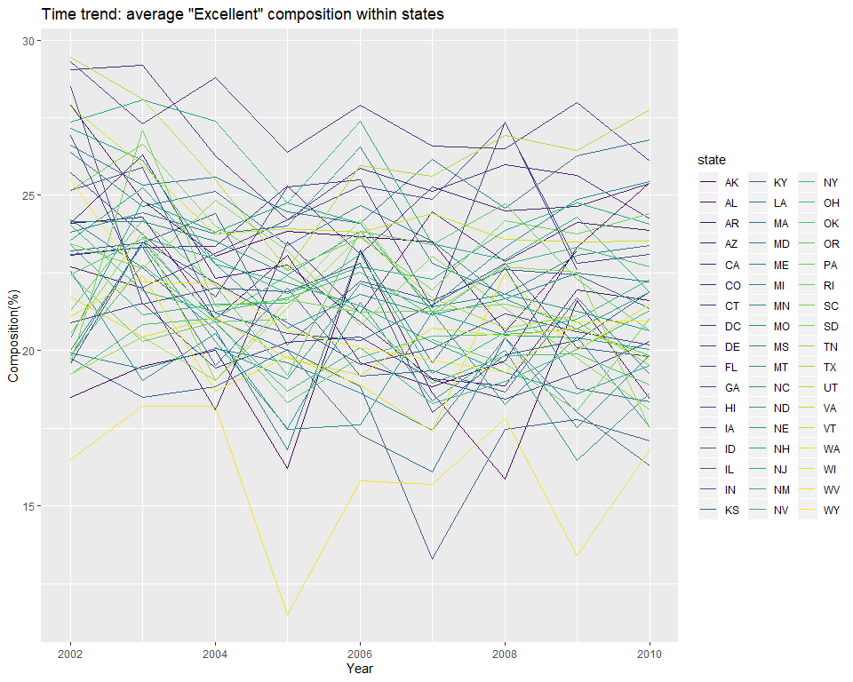
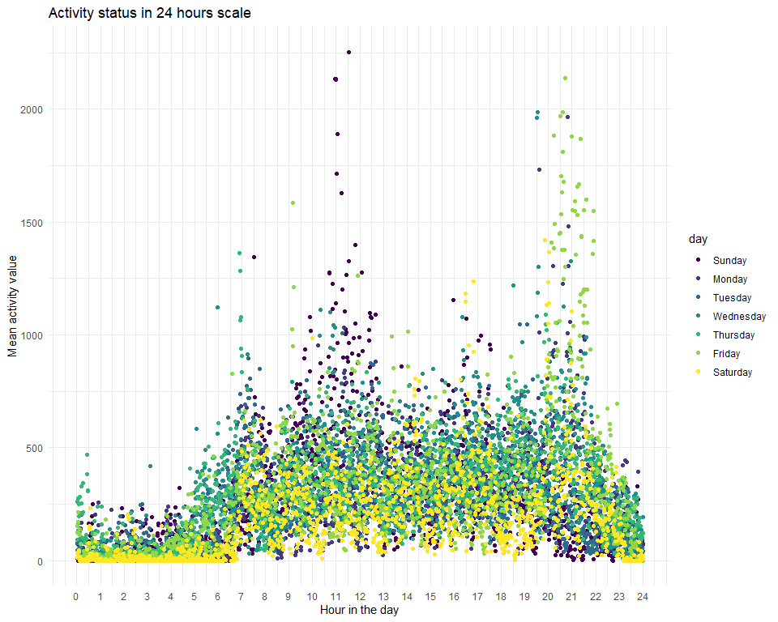

191014\_HW3
================
Gavin Ko
10/5/2019

# Problem 1

Firstly, read in instacart data:

``` r
# read in dataset
library(p8105.datasets)
data("instacart")
```

Now we set data `instacart` inplace. It’s a dataframe with 1384617
observations and 15 variables. The key variables are listed below.

`product_id` and `user_id`: the unique indicator for the item bought and
the customer who bought it.  
`reordered`: if the customer has ordered this item before.  
`order_number`: the ith time of this user to shop here.  
`product` and `aisle`: which indicates the item customer bought, and the
category(aisle) of that product.  
`department`: larger grouping of products.  
`order_dow`: indicate the day of the week which this item is ordered.  
`order_hour_of_the_day`: indicate the hour of the day which this item is
ordered.

For example, if an customer ordered a Bulgarian Yogurt, the distinctive
`user_id` and `product_id` will be recorded accordingly. Also, Bulgarian
Yogurt belongs to “yogurt” aisle, “dairy eggs” department, which would
be recored in `aisle` and `department`. On the otherhand, the purchase
behavior is made by Thursday 10am., which would fall into`order_dow` and
`order_hour_of_the_day`. When it comes to custmoer loyalty,
`order_number` and `reordered` can respectively indicate the shopping
experience of this customer at here, and if he order this same product
in the past.

## 1\. Aisles information

``` r
# data transformation
instacart = 
  instacart %>% 
  mutate(
    aisle = as.factor(aisle),
    order_dow = factor(order_dow, 
                       labels = c("Sunday", "Monday", "Tuesday",
                                  "Wednesday","Thursday", "Friday", "Saturday")))
```

``` r
# create top 10 table for aisles
instacart %>%
  count(aisle, name = "n_items_ordered") %>% 
  arrange(desc(n_items_ordered)) %>% 
  head(n = 10L) %>% 
  knitr::kable()
```

| aisle                         | n\_items\_ordered |
| :---------------------------- | ----------------: |
| fresh vegetables              |            150609 |
| fresh fruits                  |            150473 |
| packaged vegetables fruits    |             78493 |
| yogurt                        |             55240 |
| packaged cheese               |             41699 |
| water seltzer sparkling water |             36617 |
| milk                          |             32644 |
| chips pretzels                |             31269 |
| soy lactosefree               |             26240 |
| bread                         |             23635 |

The top 10 ordered aisles are shown in the table above.  
Also, there are 134 aisles in the store.

## 2\. Plot aisles with more than 10000 items

instacart %\>% group\_by(aisle) %\>% summarize()
filter(n\_items\_ordered \> 10000) %\>% arrange(desc(n\_items\_ordered))

ggplot() + histogram()

## 3\. Most popular items in three aisles

``` r
instacart %>% 
  group_by(aisle, product_name) %>% 
  summarize(n = n()) %>%
# pick the three target aisle and choose their respective top three ordered items 
  filter(min_rank(desc(n)) < 4 & aisle == "baking ingredients" |
         min_rank(desc(n)) < 4 & aisle == "dog food care" |
         min_rank(desc(n)) < 4 & aisle == "packaged vegetables fruits"
         ) %>% 
  arrange(aisle, desc(n)) %>% 
  knitr::kable()
```

| aisle                      | product\_name                                 |    n |
| :------------------------- | :-------------------------------------------- | ---: |
| baking ingredients         | Light Brown Sugar                             |  499 |
| baking ingredients         | Pure Baking Soda                              |  387 |
| baking ingredients         | Cane Sugar                                    |  336 |
| dog food care              | Snack Sticks Chicken & Rice Recipe Dog Treats |   30 |
| dog food care              | Organix Chicken & Brown Rice Recipe           |   28 |
| dog food care              | Small Dog Biscuits                            |   26 |
| packaged vegetables fruits | Organic Baby Spinach                          | 9784 |
| packaged vegetables fruits | Organic Raspberries                           | 5546 |
| packaged vegetables fruits | Organic Blueberries                           | 4966 |

As the table shown above, these are the top three popular products
within their respective aisle with their ordered count.

## 4\. Pink Lady Apples and Coffee Ice Cream

``` r
instacart %>%
# filter out the two interested product and select the key information
  filter(product_name == "Pink Lady Apples" |product_name == "Coffee Ice Cream") %>% 
  select(product_name, order_hour_of_day, order_dow) %>% 
  group_by(product_name, order_dow) %>% 
# calculate the mean hour of the day ordered, and round it to integer
  summarize(mean_hour = mean(order_hour_of_day)) %>% 
  pivot_wider(
    names_from = order_dow,
    values_from = mean_hour
  ) %>% 
  knitr::kable(digits = 0)
```

| product\_name    | Sunday | Monday | Tuesday | Wednesday | Thursday | Friday | Saturday |
| :--------------- | -----: | -----: | ------: | --------: | -------: | -----: | -------: |
| Coffee Ice Cream |     14 |     14 |      15 |        15 |       15 |     12 |       14 |
| Pink Lady Apples |     13 |     11 |      12 |        14 |       12 |     13 |       12 |

The number indicates the mean hour of the day in which is this product
bought on 24 hours’ scale.

# Problem 2

``` r
# read in dataset
data("brfss_smart2010")
```

``` r
# tidy up the dataset
brfss_tidy = 
  brfss_smart2010 %>% 
  janitor:: clean_names() %>% 
  separate(locationdesc, 
           into = c("location_st","location_spec"), sep = 5, remove = T) %>%
# choose out the interested topic and key variables
  filter(topic == "Overall Health") %>% 
  select(topic, year, state = locationabbr, location = location_spec, 
         response, answer_composition = data_value, everything(), -location_st) %>% 
# mutating to useful variable class
    mutate(
    response = factor(response, 
                      levels = c("Excellent","Very good","Good","Fair","Poor"),
                      labels = c("5","4","3","2","1")),
    response = as.numeric(as.character(response)),
    year = as.numeric(year)
    )
```

In this case, I coded `Excellent` as 5, all the way to `Poor` as 1 to
facilitate further plotting and grouping.

## 1\. Which states were observed at 7 or more locations?

``` r
brfss_tidy %>% 
  select(year, state, location, response) %>% 
# filter out the two interested years  
  filter(year == 2002 | year == 2010) %>% 
  group_by(year, state) %>% 
# summing up over distinct locations
  summarize(n = n_distinct(location)) %>% 
  filter(n >= 7) %>% 
  knitr::kable()
```

| year | state |  n |
| ---: | :---- | -: |
| 2002 | CT    |  7 |
| 2002 | FL    |  7 |
| 2002 | MA    |  8 |
| 2002 | NC    |  7 |
| 2002 | NJ    |  8 |
| 2002 | PA    | 10 |
| 2010 | CA    | 12 |
| 2010 | CO    |  7 |
| 2010 | FL    | 41 |
| 2010 | MA    |  9 |
| 2010 | MD    | 12 |
| 2010 | NC    | 12 |
| 2010 | NE    | 10 |
| 2010 | NJ    | 19 |
| 2010 | NY    |  9 |
| 2010 | OH    |  8 |
| 2010 | PA    |  7 |
| 2010 | SC    |  7 |
| 2010 | TX    | 16 |
| 2010 | WA    | 10 |

Accordingly, in 2002,`CT`, `FL`, `MA`, `NC`, `NJ`, `PA` states have
observations from more than 7 locations.  
In 2010, `CA`, `CO`, `FL`, `MA`, `MD`, `NC`, `NE`, `NJ`, `NY`, `OH`,
`PA`, `SC`, `TX`, `WA` states have observations from more than 7
locations.

## 2\. “Excellent” time trend plot

``` r
brfss_tidy %>% 
# limit the data to "excellent" response
  filter(response == 5) %>% 
  select(year, state, answer_composition) %>% 
  group_by(year, state) %>% 
  summarize(
    mean_composition = mean(answer_composition)
  ) %>% 
  ggplot(aes(x = year, y = mean_composition)) + 
    geom_line(aes(color = state)) + 
    labs(title = "Time trend: average \"Excellent\" composition within states", 
         x = "Year", y = "Composition(%)") + 
    theme_set(theme_minimal() + theme(legend.position = "right"))
```



For “spaghetti” plot, since the data included all have corresponding
discrete year, so line plots should be a good fit under this condition.

## 3\. Panel comparison: 2006 vs 2010

``` r
brfss_tidy %>% 
# choose out 2006 and 2010 data to do the comparison
  filter(state == "NY", year == 2006 | year == 2010) %>% 
  select(year, location, answer_composition, response) %>%
  ggplot(aes(x = response, y = answer_composition, color = location)) + 
  geom_point(alpha = 0.5) + geom_line() + 
  facet_grid(~ year) +
  labs(title = "Composition according to responses between locations",
       x = "Response(Poor ~ Excellent)",y = "Composition(%)")
```


Given the same reason in “Excellent” plot, I consider line plots as the
best fit. To help better recognize each location, I put points on each
data as well.

# Problem 3

## 1\. Clean data and describe

First of all, read in and clean the data.

``` r
# read in and clear the form
acc_data = 
  read.csv("data/accel_data.csv", header = T) %>% 
  janitor::clean_names() %>% 
  pivot_longer(
    activity_1:activity_1440,
    names_to = "minute",
    values_to = "activity") %>%
  separate(minute, into = c("act", "minute"), 
                   sep = "_") %>%
# change to useful variable class
  mutate(
    week = as.factor(week),
    day = factor(day, levels = c("Sunday", "Monday", "Tuesday",
                                "Wednesday","Thursday", "Friday", "Saturday")),
    day_group = ifelse(day == 0 | day == 6, "weekend", "weekday"),
    minute = as.numeric(minute),
    activity = round(activity, digits = 0) ) %>% 
    select(week, day_id, day, day_group, minute, activity)
```

The resulting dataset has 50400 rows of observations, with 6 of
variables. Variables in use include week, day\_id, day, day\_group,
minute, activity.  
`day_group` indicate the status of weekday/ weekend, `activity`
indicates the subject’s activity status at that minute.

## 2\. Aggregate accross minute analysis

``` r
acc_data %>% 
  group_by(day) %>% 
  summarize(day_sum = sum(activity)) %>% 
  knitr::kable()
```

| day       | day\_sum |
| :-------- | -------: |
| Sunday    |  1919213 |
| Monday    |  1858701 |
| Tuesday   |  1799247 |
| Wednesday |  2129770 |
| Thursday  |  2091175 |
| Friday    |  2291702 |
| Saturday  |  1369237 |

While there’s a small peak at Wednesday to Friday, the subject have a
regular activity basis. The only exception is Saturday, which recorded a
relatively low total of activity value.

## 3\. Course of the day analysis

``` r
acc_data %>%
  group_by(day, minute) %>% 
  summarize(mean_activity = mean(activity)) %>% 
  ggplot(aes(x = minute ,y = mean_activity, color = day, fill = day)) + 
  geom_point(alpha = 0.5) + 
  scale_x_continuous(
    breaks = c(seq(0, 1440, by = 60)),
    labels = c(seq(0, 24, by = 1))) + 
  labs(
    title = "Activity status in 24 hours scale",
    x = "Hour in the day",
    y = "Mean activity value")
```



Trend that can be seen in this plot:

1.Two activity peak emerges accross days: 11-12 o’clock and 20-22 o’
clock.  
2.The most active day is Sunday, but not at night. Peak values at 20-22
period mostly belong to Friday.  
3.The least active day is Saturday, which is corresponding to the result
shown in part two.  
4.Subject’s inactive/rest cycle is generally from 23 o’clock to around
6:30 on the next day.
